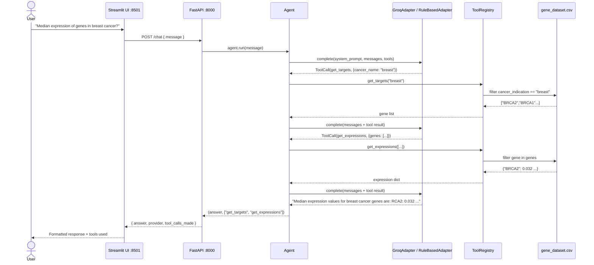
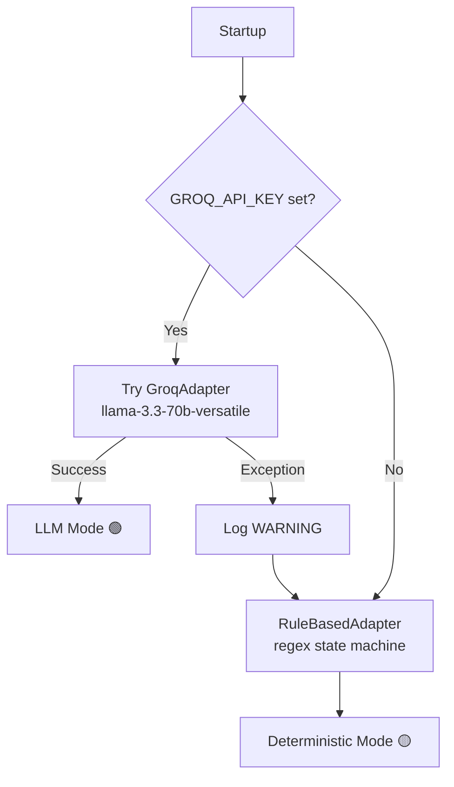

# Gene Explorer 🧬


Gene Explorer is an agentic AI prototype that lets non-technical researchers ask natural language questions about cancer gene expression data. It orchestrates data-lookup functions (combining multiple tool calls when needed) and works out of the box with zero configuration.

---

## Service Workflow Overview

The agent receives a natural-language question, decides which tools to call, executes them against the CSV dataset, and returns a natural language formated answer.



---

## Provider Selection



---

## Quick Start

### Prerequisites

Docker Desktop must be installed on your machine before continuing.

| Platform | Download |
|---|---|
| **macOS** (Apple Silicon & Intel) | [Docker Desktop for Mac](https://docs.docker.com/desktop/install/mac-install/) |
| **Windows 11** | [Docker Desktop for Windows](https://docs.docker.com/desktop/install/windows-install/) |

> For a step-by-step walkthrough across all platforms, see this [comprehensive guide](https://medium.com/@piyushkashyap045/comprehensive-guide-installing-docker-and-docker-compose-on-windows-linux-and-macos-a022cf82ac0b).

---

### Running the Service

**1. Clone the repository**
```bash
git clone https://github.com/chemicalstan/gene-explorer.git
cd gene-explorer
```

**2. Set up your API key**

The agent uses `llama-3.3-70b-versatile` via Groq. Get a free key at [console.groq.com/keys](https://console.groq.com/keys).
```bash
cp .env.example .env
```

Open `.env` and add your key:
```
GROQ_API_KEY=gsk_...your_key_here...
```

**3. Start the services**
```bash
docker compose up --build
```
---

```
agent/
├── backend/
│   ├── adapters/
│   │   ├── base.py               # BaseLLMAdapter, LLMResponse, ToolCall
│   │   ├── groq_adapter.py       # GroqAdapter — llama-3.3-70b-versatile
│   │   └── rule_based_adapter.py # Deterministic fallback — no API key needed
│   ├── tools/
│   │   ├── base.py               # BaseTool interface
│   │   ├── registry.py           # ToolRegistry — name → tool lookup
│   │   ├── get_targets.py        # Returns gene list for a cancer type
│   │   └── get_expressions.py    # Returns median expression values for genes
│   ├── agent/
│   │   └── agent.py              # Agentic loop (MAX_ITERATIONS=5) + system prompt
│   ├── api/
│   │   └── routes.py             # FastAPI app factory — /chat and /health
│   ├── data/
│   │   └── gene_dataset.csv      # 81-row dataset, 10 cancer types
│   └── config.py                 # Provider factory — Groq → RuleBased fallback
├── frontend/                     # Streamlit chat UI
├── tests/                        # Mirrors backend/ structure one-to-one
├── main.py                       # Composition root — wires all components
├── Dockerfile
├── docker-compose.yml
├── .env.example
└── README.md
```

</details>

**References:**
- Groq Tool Use docs: https://console.groq.com/docs/tool-use
- Groq Agentic Tooling: https://console.groq.com/docs/agentic-tooling
- Groq API Reference: https://console.groq.com/docs/api-reference
- Groq community — tool calling errors: https://community.groq.com/t/tool-calling-errors-on-both-gpt-oss-models/406