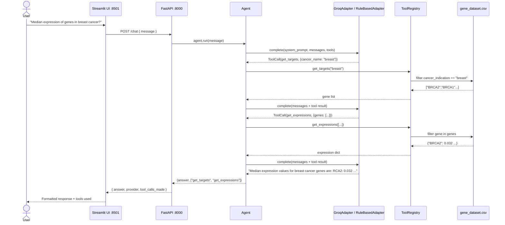
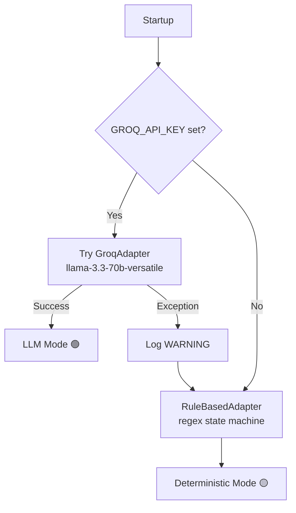

# Gene Explorer 🧬


Gene Explorer is an agentic AI prototype that lets non-technical researchers ask natural language questions about cancer gene expression data. It orchestrates data-lookup functions (combining multiple tool calls when needed) and works out of the box with zero configuration.

---

## Service Workflow Overview

The agent receives a natural-language question, decides which tools to call, executes them against the CSV dataset, and returns a natural language formated answer.



---

## Provider Selection



---

## Quick Start

### Prerequisites

Docker Desktop must be installed on your machine before continuing.

| Platform | Download |
|---|---|
| **macOS** (Apple Silicon & Intel) | [Docker Desktop for Mac](https://docs.docker.com/desktop/install/mac-install/) |
| **Windows 11** | [Docker Desktop for Windows](https://docs.docker.com/desktop/install/windows-install/) |

> For a step-by-step walkthrough across all platforms, see this [comprehensive guide](https://medium.com/@piyushkashyap045/comprehensive-guide-installing-docker-and-docker-compose-on-windows-linux-and-macos-a022cf82ac0b).

---

### Running the Service

**1. Clone the repository**
```bash
git clone https://github.com/chemicalstan/gene-explorer.git
cd gene-explorer
```

**2. Set up your API key**

The agent uses `llama-3.3-70b-versatile` via Groq. Get a free key at [console.groq.com/keys](https://console.groq.com/keys).
```bash
cp .env.example .env
```

Open `.env` and add your key:
```
GROQ_API_KEY=gsk_...your_key_here...
```
>**Note** If you choose not to set an API key, the app still works — it falls back to a built-in deterministic rule engine that covers all required queries without an internet connection.

**3. Start the services**
```bash
docker compose up --build
```

Both services start automatically:

| Service | URL | Description |
|---|---|---|
| **Frontend** (Streamlit UI) | http://localhost:8501 | Chat interface for non-technical users |
| **Backend** (FastAPI) | http://localhost:8000 |  http://localhost:8000/docs |

**4. Try the app**

- For and interactive UI, open http://localhost:8501 in your browser

- To interact and curl commands, see [API Examples](/assets/api-examples.md)

**5. Run the test suite**
```bash
docker compose run --rm backend pytest tests/ -v
```

**6. Tear down**
```bash
docker compose down
```

---

## How this project is organized
See a high level overview below of how this project is structured.
```
agent/
├── backend/
│   ├── adapters/
│   │   ├── base.py               # BaseLLMAdapter, LLMResponse, ToolCall
│   │   ├── groq_adapter.py       # GroqAdapter
│   │   └── rule_based_adapter.py # Deterministic fallback — no API key needed
│   ├── tools/
│   │   ├── base.py               # BaseTool interface
│   │   ├── registry.py           # ToolRegistry
│   │   ├── get_targets.py        # Returns gene list for a cancer type
│   │   └── get_expressions.py    # Returns median expression values for genes
│   ├── agent/
│   │   └── agent.py              # Agentic loop
│   ├── api/
│   │   └── routes.py             # FastAPI app factory — /chat and /health
│   ├── data/
│   │   └── gene_dataset.csv      # dataset
│   └── config.py                 # Provider factory — Groq → RuleBased fallback
├── frontend/                     # Streamlit chat UI
├── tests/                        # Mirrors backend/ structure one-to-one
├── main.py                       # Composition root — wires all components
├── Dockerfile
├── docker-compose.yml
├── .env.example
└── README.md
```
---


## Design Decisions & Tradeoffs

The prototype follows a modular architecture where a lightweight agent orchestrates tool calls to query a local gene dataset and produce natural language answers. The system consists of four main layers: a Streamlit UI, a FastAPI backend, an Agent orchestration layer, and a Tool Registry that interacts with the CSV dataset.

### Design Patterns

**Adapter Pattern** — LLM providers sit behind a common interface, making it easy to swap between Groq or a rule-based fallback without touching the agent or API layer.

**Tool Registry Pattern** — All executable functions are registered as tools, so the agent can discover and invoke them dynamically — keeping it fully decoupled from data access logic.

**Dependency Inversion** — High-level components depend on interfaces, not concrete implementations, making future swaps of LLM providers or orchestration logic straightforward.

**Docker** — Containerisation ensures consistent behaviour across Mac, Windows, and Linux, with deployment simplicity in mind.

### Execution Modes

**LLM Mode** *(default)* — Uses Groq to interpret queries and dynamically orchestrate multi-step tool calls. Flexible and extensible.

**Deterministic Mode** *(fallback)* — When no API key is available or the LLM fails, a rule-based adapter using regex and a lightweight state machine takes over. The app always runs, no external dependencies needed.

### Trade-offs

LLMs bring flexible natural language understanding and easy extensibility, but introduce latency, reliability risks, and occasional hallucinated or malformed tool calls. To mitigate this, the prototype uses low-temperature configuration, explicit tool schemas, and retry logic — with the deterministic fallback as a final safety net.

### Future Improvements

- Stronger LLM guardrails and output validation
- A more robust deterministic fallback using intent classification and a finite-state rule engine

## AI-Assisted Coding

AI was used as a productivity aid — architecture, design decisions, and core logic were written and validated manually.

**Pros**

- Given the 4-hour constraint (and my ongoing MSc examination and coursework), AI helped accelerate repetitive tasks such as boilerplate code, test scaffolding, and some UI components, allowing me to focus more on architectural decisions and system behavior.
- It was also useful for exploring unfamiliar APIs, particularly the Groq SDK, surfacing usage patterns quickly and reducing time spent in documentation. It also helped refine parts of the rule-based fallback logic and catch issues during development.

**Cons**

- AI-generated code requires careful supervision — models can hallucinate implementations or suggest patterns that don't match the intended design, so all output had to be reviewed and validated.
- There's also a tendency to over-engineer or produce redundant code, which needed manual trimming to keep the implementation appropriately scoped.

> *In this project I used AI as an accelerator to achieve faster implementation and debugging, however, the architectural decisions and correctness stayed under manual control.*

---
**References:**
- Groq Tool Use docs: https://console.groq.com/docs/tool-use
- Groq Agentic Tooling: https://console.groq.com/docs/agentic-tooling
- Groq API Reference: https://console.groq.com/docs/api-reference
- Groq community — tool calling errors: https://community.groq.com/t/tool-calling-errors-on-both-gpt-oss-models/406