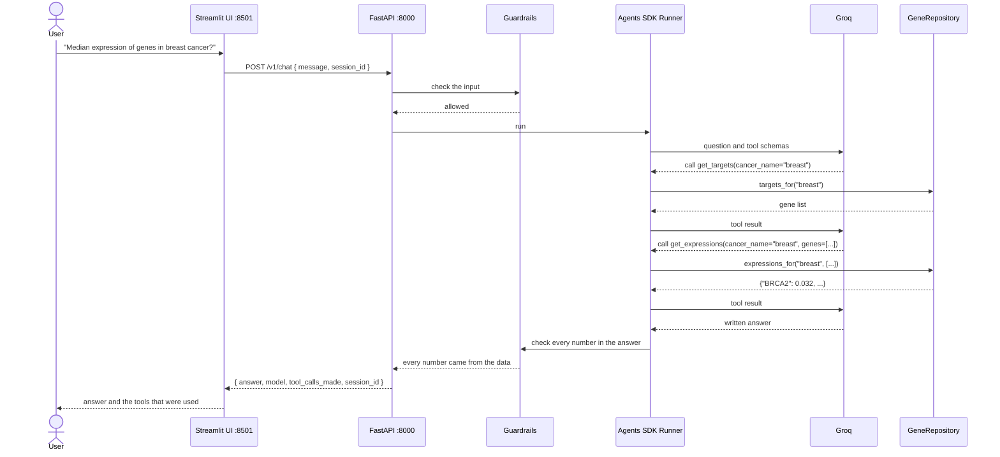

# Gene Explorer 🧬

[](https://github.com/chemicalstan/gene-explorer/actions/workflows/ci.yml)
[](https://github.com/chemicalstan/gene-explorer/actions/workflows/security.yml)
[](https://github.com/chemicalstan/gene-explorer/actions/workflows/codeql.yml)

Gene Explorer answers natural language questions about a cancer gene expression
dataset. An agent selects the data tools to call, reads the values from the
dataset, and writes the answer. Every number in the answer is checked against the
data before the answer reaches the user.

---

## How a request is served



---

## Quick start

### 1. Prerequisites

Install [Docker Desktop](https://docs.docker.com/desktop/) for
[macOS](https://docs.docker.com/desktop/install/mac-install/) or
[Windows](https://docs.docker.com/desktop/install/windows-install/).

### 2. Get a Groq API key

The agent calls a model on Groq, so you must supply your own key. Create one at
[console.groq.com/keys](https://console.groq.com/keys).

### 3. Configure the service

```bash
git clone https://github.com/chemicalstan/gene-explorer.git
cd gene-explorer
cp .env.example .env
```

Open `.env` and set your key:

```
GROQ_API_KEY=gsk_...your_key_here...
```

Every other setting has a default. See [Configuration](#configuration).

### 4. Start the service

```bash
docker compose up --build
```

| Service | URL | Description |
|---|---|---|
| Chat UI | http://localhost:8501 | Ask questions in a browser |
| API | http://localhost:8000 | See http://localhost:8000/docs for the OpenAPI page |
| Redis | internal | Stores conversation history |

### 5. Ask a question

Open http://localhost:8501, or call the API directly. See
[API examples](/assets/api-examples.md).

```bash
curl -s -X POST http://localhost:8000/v1/chat \
  -H "Content-Type: application/json" \
  -d '{"message": "What is the median expression of BRCA2 in breast cancer?"}'
```

### 6. Stop the service

```bash
docker compose down
```

---

## Guardrails

The service checks both the question and the answer.

**Input.** A deterministic filter rejects known prompt-injection patterns before
the model runs. The request is answered with a fixed message and no tool is
called.

**Tool arguments.** The cancer type is a strict enum built from the dataset at
startup, so the model can only ask for a cancer that exists. An argument that
fails validation is returned to the model as an error instead of reaching the
data.

**Output.** Every decimal number in the answer must be a value that a tool
returned. The check is deterministic: it compares the numbers in the answer with
the numbers the tools produced, uses no model, and cannot be changed by the
content of the answer. If any number is unaccounted for, the service withholds the
answer and says so. This is the control that stops the service reporting a value
it did not read from the dataset.

Two limits of the output check are stated in the code: it reads numbers without
their gene or cancer context, and it does not check integers, because counts such
as "10 genes" are legitimate.

---

## Conversations

A request may carry a `session_id`. Requests that share an id share history, so a
follow-up question such as "what was that value again?" keeps its context.

A conversation is scoped to its caller. The storage key is a hash of the caller's
API key, so two callers that use the same `session_id` get two separate
conversations. For this reason a `session_id` requires an `X-API-Key` header; a
request without a session id needs no key unless `API_KEYS` is set.

History is bounded by `SESSION_MAX_ITEMS` and expires after
`SESSION_TTL_SECONDS`, so the token cost per turn and the stored data both stay
bounded.

---

## API

| Method | Path | Description |
|---|---|---|
| POST | `/v1/chat` | Ask a question |
| GET | `/v1/health/live` | Liveness probe |
| GET | `/v1/health/ready` | Readiness probe, reports the model |

`POST /v1/chat` accepts `message` (1 to 2000 characters) and an optional
`session_id`. It returns `answer`, `model`, `tool_calls_made`, and `session_id`.

Send the API key, when one is configured, in the `X-API-Key` header. Requests are
rate limited per key, or per client address when there is no key.

Every response carries an `X-Request-ID` header. The same id appears in every log
line for that request.

---

## Configuration

Set these in `.env`. Only `GROQ_API_KEY` is required.

| Variable | Default | Description |
|---|---|---|
| `GROQ_API_KEY` | *required* | Your Groq API key |
| `MODEL` | `openai/gpt-oss-120b` | The Groq model to use |
| `GROQ_BASE_URL` | `https://api.groq.com/openai/v1` | The Groq endpoint |
| `TEMPERATURE` | `0.0` | Sampling temperature |
| `REASONING_EFFORT` | `low` | `low`, `medium`, or `high` |
| `SEED` | `42` | Sampling seed |
| `MAX_TURNS` | `6` | Maximum agent steps for one question |
| `REQUEST_TIMEOUT_S` | `30.0` | Timeout for one model call |
| `API_KEYS` | empty | Comma-separated accepted keys. Empty disables authentication |
| `GENE_EXPLORER_API_KEY` | empty | The key the UI presents to the API |
| `RATE_LIMIT` | `60/minute` | Limit for `/v1/chat` |
| `RATE_LIMIT_STORAGE_URI` | `memory://` | Set a `redis://` URI to share the limit |
| `SESSION_BACKEND` | `memory` | `memory` or `redis` |
| `REDIS_URL` | `redis://localhost:6379/0` | Used when the backend is `redis` |
| `SESSION_TTL_SECONDS` | `3600` | Conversation lifetime |
| `SESSION_MAX_ITEMS` | `40` | Maximum stored history items |
| `ALLOWED_ORIGINS` | `http://localhost:8501` | Comma-separated CORS origins |
| `LOG_LEVEL` | `INFO` | `DEBUG`, `INFO`, `WARNING`, or `ERROR` |
| `LOG_JSON` | `true` | `false` gives readable console output |
| `INPUT_PRICE_PER_1M` | `0.15` | Input price used for cost accounting |
| `OUTPUT_PRICE_PER_1M` | `0.60` | Output price used for cost accounting |
| `CSV_PATH` | packaged dataset | Path to a different dataset |

For more than one instance, set `SESSION_BACKEND=redis` and point
`RATE_LIMIT_STORAGE_URI` at Redis, so every instance shares the conversation
history and the rate-limit counters. `docker compose` does this already.

---

## Operations

**Health.** `/v1/health/live` reports that the process is running.
`/v1/health/ready` reports that the dataset loaded and names the model. Both are
open, so probes need no key.

**Logs.** Every line is JSON and carries the request id. Each answered question
logs one `chat_completed` line with the model, the tools used, the token counts,
and an estimated cost. The message text and the API key are never logged.

**Container.** The image runs as a non-root user and declares a health check.

---

## Development

The project uses [uv](https://docs.astral.sh/uv/).

```bash
uv sync
uv run pytest
uv run ruff check src tests frontend
uv run mypy src
```

Tests that call the real Groq API are skipped unless `GROQ_LIVE_TEST=1` is set
and `GROQ_API_KEY` holds a valid key.

```bash
GROQ_LIVE_TEST=1 uv run pytest
```

Run the API and the UI without Docker:

```bash
uv run uvicorn gene_explorer.asgi:build_app --factory --reload
cd frontend && streamlit run index.py
```

### Continuous integration

Every pull request runs three workflows:

- **CI** — `ruff`, `mypy` in strict mode, and `pytest` with a 90 percent coverage
  floor, plus a Docker build.
- **Security** — `gitleaks` for secrets in the git history, `pip-audit` for known
  dependency vulnerabilities, `bandit` for static analysis, and `trivy` for
  vulnerabilities and Dockerfile misconfiguration.
- **CodeQL** — static analysis of the Python source.

---

## Structure

```
src/gene_explorer/
├── repository.py        # The data layer. pandas over the CSV
├── tools.py             # The agent tools, built from the repository
├── prompts.py           # The system prompt, built from the repository
├── agent.py             # Builds and runs the agent
├── guardrails.py        # Input and output checks
├── sessions.py          # Conversation storage, in memory or in Redis
├── auth.py              # API-key check
├── config.py            # Settings, read from the environment
├── logging_config.py    # Structured logging
├── asgi.py              # Composition root
├── api/                 # Routes, schemas, and the application factory
└── data/                # The dataset
frontend/
├── api_client.py        # HTTP client, no Streamlit import
└── index.py             # The chat UI
tests/                   # Unit, adversarial, and end-to-end tests
```

### Design

**The dataset is the source of truth.** `GeneRepository` reads the CSV with
pandas and is the only component that touches the data. The cancer types the
agent accepts, the enum in the tool schemas, and the list in the system prompt all
come from the repository at startup, so the code holds no copy of the data. A
different dataset changes what the service accepts with no code change, and the
repository can be replaced by a database without changing its callers.

**Expression values are keyed by cancer and gene.** The dataset holds one row for
each pair, and many genes appear under more than one cancer with different values,
so a lookup that used the gene alone would return a value from another cancer.

**The agent layer is not hand-written.** The OpenAI Agents SDK runs the tool loop
against Groq through `OpenAIChatCompletionsModel`, so the project maintains its
tools, its guardrails, and its data layer, and not an SDK.

---

## References

- [Groq API](https://console.groq.com/docs/api-reference)
- [Groq models](https://console.groq.com/docs/models)
- [OpenAI Agents SDK](https://openai.github.io/openai-agents-python/)
